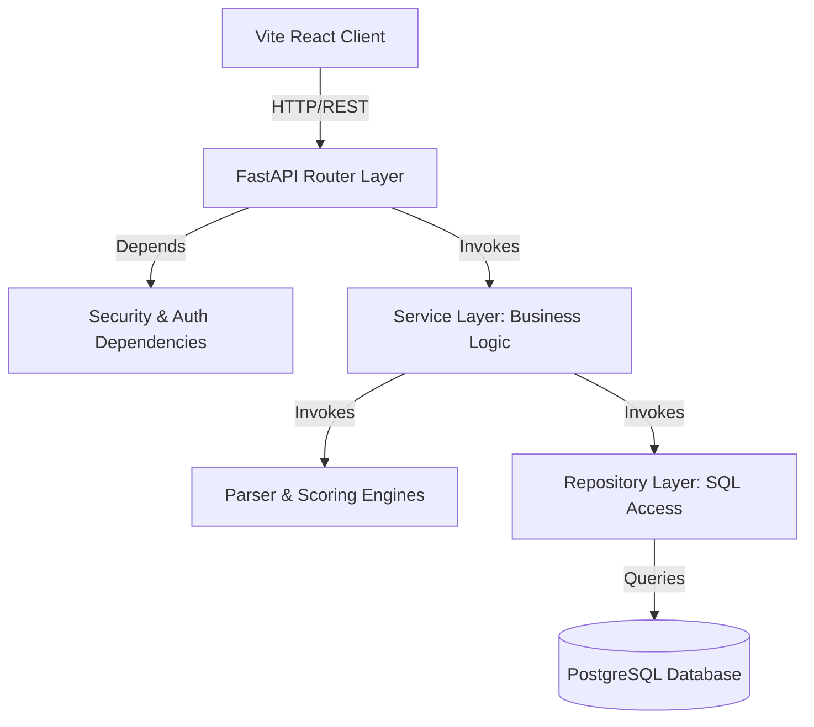

# Architecture Design Document

This document outlines the architectural structure, design patterns, and boundaries of **NaziranGPT**.

---

## 🏗️ Clean Architecture Overview

NaziranGPT uses a layered architecture to achieve a high separation of concerns, decoupling raw data access, business logic processing, and controller presentation layers.

### 1. Presentation Layer (`app/api/`)

- Acts as the entrypoint for HTTP requests.
- Maps URL routes and maps incoming JSON/Form data to Pydantic schemas.
- Expresses responses using serialized schemas, hiding sensitive fields.
- Implements slowapi rate limiting directly on routers to protect endpoint abuse.

### 2. Business Logic Layer (`app/services/`)

- Contains the core application value operations (e.g. text extraction, parsing pipelines, scoring algorithms).
- Swappable storage adapters (Disk/R2) and parsing strategies (spaCy vs. Google Gemini) are coordinated in this layer.
- Strictly decoupled from API endpoint logic and raw ORM operations.

### 3. Data Access Layer (`app/repositories/`)

- Encapsulates database query syntax (SQLAlchemy selects, updates, joins).
- Inherits from a unified `BaseRepository` that standardizes standard CRUD methods.
- Eagerly loads relational children (like a resume's education, experience, and skills) in single roundtrips using `selectinload` queries, preventing N+1 execution bottlenecks.

### 4. Enterprise Entities (`app/models/`)

- Maps Python classes directly to database schemas.
- Models do not execute code or access networking; they represent data definitions.

---

## 🔒 Security Architecture

1. **Password Security**: Credentials are encrypted before saving using the BCrypt hashing engine.
2. **Access Security**: Authenticated routes check token credentials in request headers.
3. **Session Security (Token Rotation)**:
   - Login returns a short-lived `access_token` and a longer-lived `refresh_token`.
   - Accessing a route relies on the access token. When it expires (401), the React Axios client interceptor submits a refresh request.
   - The backend validates the refresh token, revokes it immediately in the `user_sessions` database table, and returns a *brand new* access/refresh pair (Token Rotation). This restricts reuse of stolen tokens.
4. **Role-Based Access Control (RBAC)**: Route endpoint calls check the user's role against permissible groups before executing the action, managed via dependency injection.
