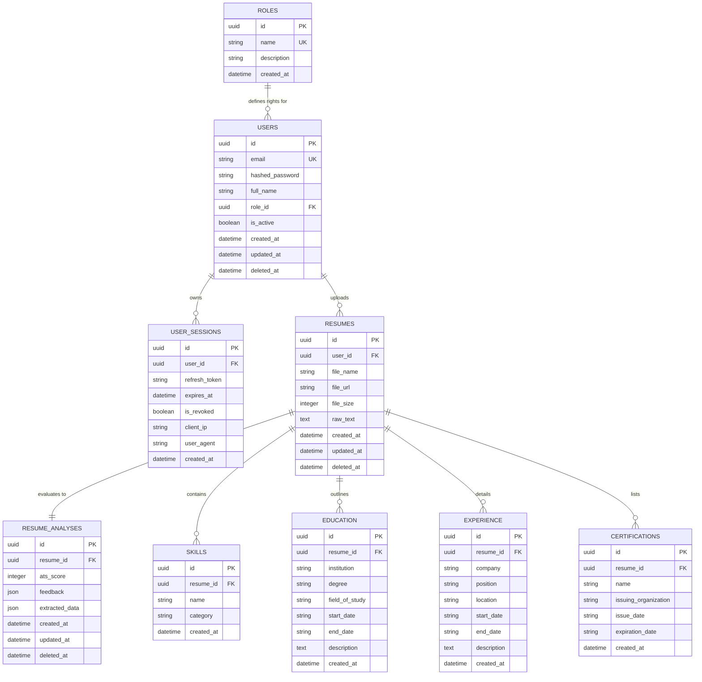

# Database Schema Documentation

This document describes the PostgreSQL database schema for the NaziranGPT MVP.

---

## 📊 Entity Relationship Diagram

---

## 🔑 Database Design Principles Implemented

1. **UUID Primary Keys**: All records use random UUIDs for key identification. This prevents sequential enumeration attacks and eases future database splits or replication.
2. **Cascade Restrictions**: Users and Resumes are protected by cascading rules. Session records cascade delete when users are purged, but delete operations on standard files trigger soft deletes to keep historical data intact.
3. **Soft Deletes**: Tables for `users`, `resumes`, and `resume_analyses` include a `deleted_at` field. Database requests check for null values on this field, enabling data recovery capabilities.
4. **Foreign Key Indexing**: All foreign keys (`role_id`, `user_id`, `resume_id`) are indexed to speed up relational lookup and join queries under high load.
