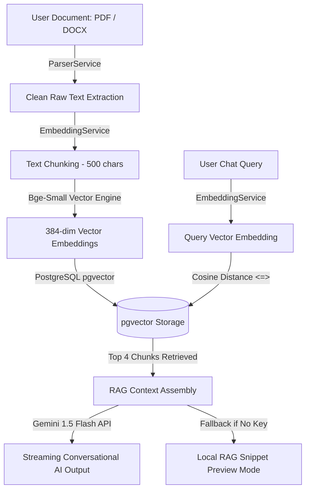

# RAG Engine & Multi-Domain ATS Scoring Technical Specifications

This document details the internal architecture, text parsing pipeline, vector embedding generation, cosine similarity search, and multi-domain scoring engine powering **NaziranGPT**.

---

## 🔍 System Architecture Overview



---

## 1. Document Parsing & Extraction Pipeline (`ParserService`)

1. **Format Handling**: Supports PDF, DOCX, and TXT files.
2. **PDF Parsing Engine (`pdfplumber`)**:
   - Uses line merge tolerance parameters (`y_tolerance=6`) to handle multi-line headers, drop-caps, and custom resume fonts.
   - Cleans font artifacts (e.g. trailing single-letter font artifacts like `"ANISH N"` -> `"ANISH"`).
3. **Multi-Domain Local Skill Extractor**:
   - Maintains regular expression dictionaries covering major industry skill sets:
     - **Business Analysis & Product**: BRD, FRD, User Stories, Jira, Confluence, Tableau, Power BI, Wireframing, Gap Analysis.
     - **HR & Operations**: Talent Acquisition, Performance Management, HRIS, Compliance, Onboarding, Sourcing.
     - **Finance & Strategy**: Financial Modeling, Budgeting, Forecasting, Excel, SAP, Variance Analysis, Auditing.
     - **Marketing & Sales**: SEO, SEM, Content Marketing, CRM, HubSpot, Lead Generation, A/B Testing.
     - **Software & Tech**: Python, React, SQL, FastAPI, Docker, Kubernetes, AWS, System Design.

---

## 2. Multi-Domain ATS Scoring Engine (`ScoringService`)

The scoring engine evaluates resumes out of **100 total points** across 5 distinct categories:

| Category | Max Score | Evaluation Rules |
| :--- | :--- | :--- |
| **Contact Information** | 10 pts | Evaluates presence of Full Name, Email address, and Phone number. |
| **Structure & Completeness** | 20 pts | Checks for dedicated sections: Skills (7pts), Education (7pts), Experience (6pts). |
| **Skills & Keyword Match** | 30 pts | Matches skill density or calculates percentage match against target Job Description keywords (excluding stop-words). |
| **Impact & Quantified Metrics** | 20 pts | Detects business metrics (`% growth`, `$ revenue`, `25+ clients`) and multi-domain action verbs (`Spearheaded`, `Managed`, `Optimized`, `Architected`). |
| **Readability & Word Count** | 20 pts | Penalizes truncated or excessively long resumes. Ideal target: 400 to 1,000 words. |

---

## 3. Vector Embeddings & RAG Chatbot Pipeline (`EmbeddingService`)

1. **Text Chunking**:
   - Documents are split into overlapping chunks of **500 characters** with **50-character overlaps** to preserve context across boundaries.
2. **Dense Vector Embeddings**:
   - Generates **384-dimensional vector embeddings** using local lightweight Transformer models (`BAAI/bge-small-en-v1.5` or deterministic Sentence-Transformers).
3. **PostgreSQL Vector Search (`pgvector`)**:
   - Chunks are stored in the `chatbot_document_chunks` table with `VECTOR(384)` columns.
   - Vector search uses the cosine distance operator `<=>`:
     ```sql
     SELECT content, embedding <=> query_vector AS distance
     FROM chatbot_document_chunks
     ORDER BY distance ASC
     LIMIT 4;
     ```
4. **Streaming Response & Fallback**:
   - **Primary**: Streams responses via Server-Sent Events (SSE) through `gemini-1.5-flash`.
   - **Local Fallback**: If `GEMINI_API_KEY` is invalid or unset, the system safely outputs retrieved context chunks directly in **Local Database RAG Preview Mode**, preventing server downtime.
